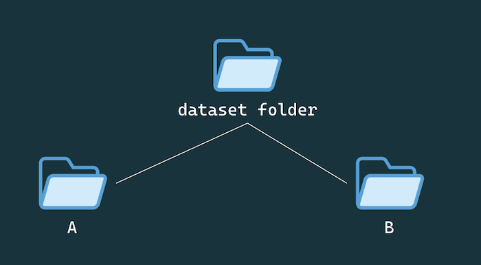

Colab version for those that can't run this training locally: [https://colab.research.google.com/drive/1fN8neIOUJh94JaxjoFTw4XJE_SD2ywQi](https://colab.research.google.com/drive/1fN8neIOUJh94JaxjoFTw4XJE_SD2ywQi)


# Pix2Pix kit

Train a pix2pix model from scratch on your own images (600 minimum pairs), entirely on your laptop, then export to a `.pict` file to run the finished generator live in a web page with ml5js.

## Requirements

- A Mac with Apple Silicon (M1/M2/M3/M4)
- Xcode Command Line Tools: `xcode-select --install`
- Python 3.10 or 3.11 (recommend via [pyenv](https://github.com/pyenv/pyenv) or
  [miniconda](https://docs.conda.io/en/latest/miniconda.html) 
- `git`

## Understanding paired data

pix2pix expects your training images to be split into two paired folders inside your dataset directory:


Remember this is an image-to-image translation model so the model is learning how map an image from domain A (the source/input domain) to domain B. For example, if the model is going from line drawing to cat, then dataset A would be outlines of cats and dataset B would be corresponding photos of cats. But if you wanted a model that could take a photo of a cat and create an outline from it, your dataset A would be photos of cats and your dataset B would be corresponding outlines of cats.

### **You can use these colab scripts to automate some of the dataset creation process:**

- [Convert images to outlines using edge detection](https://colab.research.google.com/drive/1tHe1A7xLyvOItGwiYbvi1QMFay3AqmuS?usp=sharing&authuser=1)
- [Convert images to face landmarks](https://colab.research.google.com/drive/1NzeXcGJmHv0WW7Wz31Kp7UWHLYsBXihE?usp=drive_link)
- [Convert images to silhouettes](https://colab.research.google.com/drive/1AlrbBdSoiDO7CfruaeQ8RPt4WPrZuYfr?usp=sharing&authuser=1)
- [Convert images to hand pose](https://colab.research.google.com/drive/1KKG63Is7m1jB9BNytFt1fYATel2o-gwo?authuser=1)

### **This repo also contains a script for converting to outlines using edge detection locally** which you can use like so:

```bash
pip install opencv-python-headless

python scripts/generate_edges.py --input path/to/dataset/B --output path/to/dataset/A  
```

You can update the threshold by adding these flags
`--low-threshold` and  `--high-threshold`    
  
example:
```bash
python scripts/generate_edges.py --input path/to/data/B --output path/to/data/A  --low-threshold 30 --high-threshold 100 
```

## Once you have your dataset A & B images figured out put the dataset folder in the `data/` folder of this repository.
```bash
pix2pix-at-home
    |____ data
            |____ your_dataset_folder
                      |_____ A
                      |_____ B
```

## Crop your images to centered squares and optionally add horizontally flipped copies (for augmentation).

```bash
     python scripts/square_flip.py --input data/your_dataset/B --output data/your_dataset/B_processed  --flip
     python scripts/square_flip.py --input data/your_dataset/A --output data/your_dataset/A_processed  --flip
```


## Set up the environment
In your terminal:

```bash
python3 -m venv .venv
source .venv/bin/activate

pip install --upgrade pip
pip install -r requirements.txt

# Clones affinelayer/pix2pix-tensorflow into vendor/ and patches it for TF2 compat.v1
bash setup.sh
```


## Configure your paths

Edit `config.env`:

```
A_DIR=./data/your_dataset/A_processed              # your source/input images
B_DIR=./data/your_dataset/B_processed              # your target/output images (same filenames as A)
COMBINED_DIR=./data/your_dataset/combined          # where the combined A/B images that are used for training will be saved
CKPT_DIR=./checkpoints/my_model.                   # where your model checkpoints are saved
PICT_OUTPUT=./models/my_custom_model.pict          # where your final trained converted model is saved

# leave these be for now

WHICH_DIRECTION=AtoB
MAX_EPOCHS=200
LR=0.0001
SAVE_FREQ=100
DISPLAY_FREQ=500
```

`A_DIR` and `B_DIR` must contain images with **matching filenames** (e.g.
`A/leaf001.jpg` pairs with `B/leaf001.jpg`).


## Prepare the data

Resize everything to 256×256 and stitch each A/B pair into a single
512×256 side-by-side image (A left, B right — what pix2pix trains on):

```bash
python scripts/resize_images.py
python scripts/combine_pairs.py
```

## Train

```bash
pip install tf_keras
bash scripts/train.sh
```
Note that each checkpoint is around ~700MB so be wary of how much space you have on your computer.
This repo is set up so that only the latest checkpoint is saved so you should not need to periodically delete older checkpoints.

This wipes `CKPT_DIR` and starts fresh. To resume an interrupted training run instead:

```bash
bash scripts/resume_train.sh
```

## Export to `.pict` for use on the web

```bash
bash scripts/export_pict.sh
```

This freezes the checkpoint and converts it to `models/my_custom_model.pict`
(or wherever `PICT_OUTPUT` points). That file is what the [pix2pix interactive
web demo](https://handmadedatasets.com/pix2pixuploaddemo/) loads to run inference in the browser.


## Reading the training log

Each logged line looks like:

```
[  2000/40000] D: 0.62 (recon 0.31)  G: 1.10  1840s elapsed
```

- **D** and **G** are the discriminator/generator losses. The discriminator loss measures how well the discriminator distinguishes real data from fake data, while the generator loss measures how well the generator tricks the discriminator into believing its fake data is real. Generally speaking, you are looking for a general decrease over time in both. There might be some slight jumping around but what you *don't want* is a huge increase randomly or a collapse into 0. Personally, I find it really hard for me to assess using these numbers and so I instead look at the visual outputs from the samples. 

## Troubleshooting / what can go wrong

**Samples are saved in `checkpoints/your_model_name/images/` triplets: input, generated, and target. Input is the original A sample from your dataset, target is the original B sample from your dataset, and generated is what the model generated from that A sample.**

- **Samples stay blurry mush past a few thousand iterations:** Your images might be too varied for the model to grasp any patterns and so you can either increase the amount of data or figure out creative ways of "homogenizing" the dataset further (like removing and norming the background).
- **Samples look identical to each other (mode collapse):** the model
  found one shortcut output that fools the discriminator. Try lowering
  `--lr`, or check your dataset isn't dominated by near-duplicate images 
  (aka add more variety to your images).
- **Samples start looking great, then degrade later in training:** It could be that your model just trained really fast and you kind of *overtrained it*. You can always go back to an earlier checkpoint in  `runs/.../checkpoints/`, they're kept periodically (`--keep_last` controls how many).
- **`RuntimeError` mentioning MPS / an unsupported operator:** 
  You should use the colab version instead because maybe your laptop doesn't support running this locally.
- **The web export step fails:**  Email me if you are running into issues with this part. Worse come to worse, we can convert your model file on my laptop.


## More Troubleshooting

**`AttributeError` mentioning `NewCheckpointReader` during export**
 re-run:
```bash
bash scripts/apply_patches.sh
```

**Training hangs, crashes, or loss becomes `NaN` with `tensorflow-metal` installed**
Uninstall it and fall back to CPU OR check if maybe your model is good enough already.:
```bash
pip uninstall tensorflow-metal
```

**`numpy` errors about deprecated/removed attributes**
`requirements.txt` pins `numpy<2` on purpose — this TF1-era code isn't
NumPy-2.0-safe. Don't upgrade it independently.

